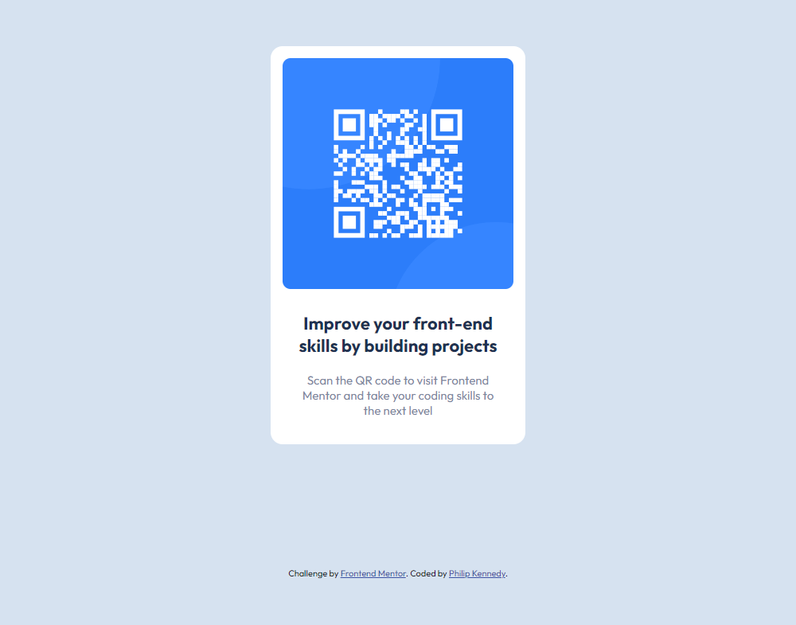

# Frontend Mentor - QR Code Component

This is my solution for the [QR Code Component](https://www.frontendmentor.io/challenges/qr-code-component-iux_sIO_H) (Newbie Challenge) on Frontend Mentor.

## Table of Contents

- [Overview](#overview)
  - [The Challenge](#the-challenge)
  - [Screenshot](#screenshot)
  - [Links](#links)
- [My Process](#my-process)
  - [Built with](#built-with)
  - [What I Learned](#what-i-learned)
  - [Useful Resources](#useful-resources)
- [Author](#author)

## Overview

### The Challenge

- **Difficulty -** `Newbie`

The challenge is to build out this QR Code Component and get it looking as close to the design as possible.

### Screenshot

### Links

- **Solution URL -** [Frontend Mentor Solution](#)

- **Live Site URL -** [Live Site Preview (Vercel)](#)

## My Process

### Built with

- Semantic HTML5 markup
- CSS custom properties

### What I Learned

How to appropriately apply semantic HTML tags instead of exclusively using div tags.

### Useful Resources

- [HTML Semantics](https://developer.mozilla.org/en-US/docs/Glossary/Semantics#semantics_in_html) **-** Useful reference for semantic HTML tags.

## Author

- **Github -** [PhlpKnndy](https://github.com/PhlpKnndy)
- **Frontend Mentor -** [PhlpKnndy](https://www.frontendmentor.io/profile/PhlpKnndy)
